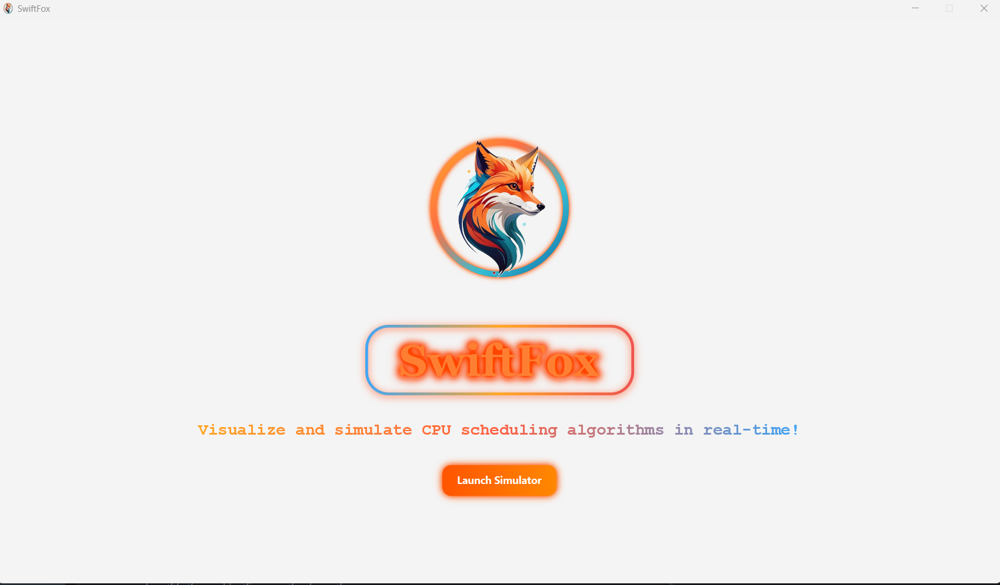
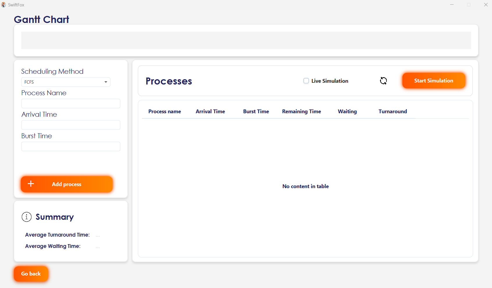

# CPU Scheduler Simulator

**CPU Scheduler Simulator** is a Java-based desktop application built with JavaFX to simulate and visualize various CPU scheduling algorithms in real time. The application offers dynamic process management, live visualization, and detailed statistical analysis—ideal for academic and educational purposes.
### Home Screen

### Processing Screen


---

## Supported Scheduling Algorithms

1. First-Come, First-Served (FCFS)
2. Shortest Job First (SJF)
   - Preemptive
   - Non-Preemptive
3. Priority Scheduling
   - Preemptive
   - Non-Preemptive
4. Round Robin (RR)

> The application only requests inputs relevant to the selected algorithm (e.g., priority values are not required for FCFS).

---

## Key Features

- Real-time simulation: 1 second = 1 time unit
- Live Gantt Chart rendering and process timeline visualization
- Dynamically add processes while the scheduler is running
- Real-time table of remaining burst times
- Calculation of:
  - Average Waiting Time
  - Average Turnaround Time
- Option to simulate only predefined processes (static scheduling mode)
- Built as a JavaFX desktop application

---

## Input Parameters by Scheduler

| Scheduler      | Required Inputs                          |
|----------------|-------------------------------------------|
| FCFS           | Arrival Time, Burst Time                  |
| SJF            | Arrival Time, Burst Time                  |
| Priority       | Arrival Time, Burst Time, Priority        |
| Round Robin    | Arrival Time, Burst Time, Time Quantum    |

---

## Getting Started

### Prerequisites

- Java JDK 11 or higher
- JavaFX SDK (if not bundled with JDK)
- Maven (used for building and running the project)

### Running the Application

### Option 1: Using the Executable EXE

#### 1. Download the `SwiftFox-Simulator.exe` file from [here](https://github.com/MoustafaHashem/SwiftFox-Simulator/releases/download/ReadyToPublish/SwiftFox.zip).

#### 2. Double-click the `.exe` file to launch the application directly on Windows — no additional setup required.

### Option 2: Using the Executable JAR

#### 1. Download the compiled .jar file from the dist/ directory.

#### 2. Run the application using:
   ```bush
   java -jar SwiftFox-Simulator.jar
   ```
### Option 3: From Source (Maven)

#### 1. Clone the repository
```bash
git clone https://github.com/MoustafaHashem/SwiftFox-Simulator.git
cd SwiftFox-Simulator
```

#### 2. Build and run using Maven:
```bash
mvn clean javafx:run
```
Note: Ensure your `pom.xml` is configured to use the JavaFX Maven Plugin and includes the necessary JavaFX modules (`javafx.controls`, `javafx.fxml`, etc.).
